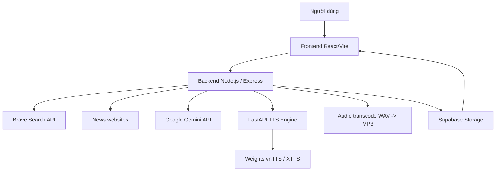

# News Summarizer & Vietnamese Regional TTS System


Đây là đồ án kết hợp nghiên cứu và ứng dụng với trọng tâm là **xây dựng hệ thống chuyển đổi văn bản sang giọng nói hỗ trợ ngữ điệu vùng miền Việt Nam**, đồng thời tích hợp thêm pipeline **tìm kiếm, cào dữ liệu và tóm tắt tin tức bằng AI** để người dùng có thể đọc nhanh hoặc nghe lại nội dung theo giọng Bắc, Trung, Nam.

Hệ thống gồm 3 lớp chính:

- **Frontend React/Vite**: giao diện tìm kiếm, lọc, xem bài viết, xem tóm tắt và phát audio.
- **Backend Node.js/Express**: điều phối search, scrape, Gemini, TTS, transcode và lưu trữ Supabase.
- **TTS Engine FastAPI**: dịch vụ sinh giọng tiếng Việt chạy riêng để tránh nghẽn khi inference.

## Mục Tiêu

- Tạo một ứng dụng web giúp người dùng tìm tin tức, gom nhiều nguồn, tóm tắt nội dung chính và nghe bản tin bằng giọng Việt tự nhiên.
- Hỗ trợ nhu cầu đọc tin nhanh, hands-free, và tăng khả năng tiếp cận cho người dùng cần audio output.
- Phục vụ phần nghiên cứu TTS của đồ án: so sánh và tinh chỉnh các hướng tiếp cận như VITS, XTTSv2 và VieNeu-TTS, sau đó triển khai runtime bằng vnTTS/XTTS stack.

## Tính Năng Chính

- Tìm kiếm tin tức bằng **Brave Search API**.
- Cào nội dung bài viết bằng **axios + cheerio** và fallback **Puppeteer**.
- Tóm tắt nội dung bằng **Google Gemini**.
- Sinh audio TTS tiếng Việt qua **FastAPI + vnTTS/XTTSv2**.
- Hỗ trợ job-based TTS và polling để tránh timeout khi sinh audio dài.
- Transcode WAV sang MP3 bằng **ffmpeg** trước khi lưu lên **Supabase Storage**.
- Giao diện có lịch sử tìm kiếm, bộ lọc, trang chủ tin tức, xem lại summary và phát audio.

## Kiến Trúc Hệ Thống



Luồng chuẩn của ứng dụng:

1. Người dùng nhập từ khóa hoặc URL bài viết.
2. Backend tìm nguồn phù hợp bằng Brave.
3. Backend cào bài viết bằng scraper.
4. Nội dung được đẩy vào Gemini để tóm tắt.
5. Tóm tắt được hiển thị trên UI và có thể chuyển thành audio.
6. Audio được sinh qua FastAPI, chuyển sang MP3 và lưu lên Supabase.

## Phần Nghiên Cứu Trong Báo Cáo

Báo cáo không chỉ mô tả ứng dụng mà còn trình bày toàn bộ quá trình nghiên cứu TTS:

- Thu thập dữ liệu từ 3 nguồn: sách nói/PDF, dataset Hugging Face, và crawl từ YouTube.
- Làm sạch, chuẩn hóa text, xử lý ngoại lệ, đồng bộ audio-text.
- EDA trên 14.475 cặp văn bản - âm thanh, tổng thời lượng khoảng 27.1 giờ.
- Chia dữ liệu theo tỉ lệ 80/10/10 cho train/validation/test.
- Thử nghiệm 3 hướng mô hình: **VITS**, **XTTSv2**, **VieNeu-TTS**.
- Đánh giá bằng các chỉ số khách quan như **MCD**, **DTW**, **FFE**.

Trong phần triển khai hiện tại, runtime TTS của ứng dụng sử dụng bộ xử lý **vnTTS** được gọi từ FastAPI, còn các mô hình và kết quả trong báo cáo là phần nghiên cứu nền tảng của đồ án.

## Chức Năng Người Dùng

- Tìm kiếm tin tức bằng từ khóa.
- Tìm và tóm tắt nhiều bài báo cùng lúc.
- Xem từng bài viết, tóm tắt theo từng bài và bản tổng hợp.
- Chọn giọng đọc và tạo audio từ summary.
- Phát audio trực tiếp từ URL công khai trên Supabase.

## Cấu Trúc Thư Mục

```text
.
├── backend/                    # API gateway Node.js/Express
│   ├── config/                 # Cấu hình Brave, Gemini, Supabase, TTS
│   ├── controllers/            # Xử lý request search/scrape/gemini/tts
│   ├── routes/                 # Khai báo route /api
│   ├── services/               # Brave, scrape, Gemini, transcode, TTS bridge
│   └── tts_fastapi/            # FastAPI TTS engine
├── frontend/                   # React/Vite web app
│   └── src/                    # UI components, services, styles
├── data/                       # Dataset, transcripts, metadata
├── models/                     # Weights, runtime model, fine-tuning assets
├── src/                        # Notebook / research code
├── quickstart.ps1              # Script chạy đồng thời các service trên Windows
├── start.sh                    # Start script cho container
├── docker-compose.yml          # Compose cho backend/frontend
├── Dockerfile                  # Container image gốc cho web app
└── README.md                   # Tài liệu dự án
```

## Công Nghệ Sử Dụng

- **Frontend**: React 19, Vite, Axios, Quill.
- **Backend**: Node.js, Express 5, CORS, dotenv.
- **Search / Scrape**: Brave Search API, Cheerio, Puppeteer.
- **Summarization**: Google Gemini API.
- **TTS**: Python 3.11, FastAPI, vnTTS, XTTS stack, PyTorch.
- **Storage**: Supabase Storage.
- **Transcode**: ffmpeg / ffmpeg-static.

## Yêu Cầu Hệ Thống

- Node.js 18+.
- Python 3.11.
- ffmpeg khả dụng trong môi trường chạy TTS/backend.
- Brave Search API key.
- Google Gemini API key.
- Supabase project URL, service key và bucket public cho audio TTS.
- GPU là khuyến nghị mạnh nếu chạy TTS local, đặc biệt với model lớn.

## Cấu Hình Biến Môi Trường

### Backend

File mẫu: [backend/.env.example](backend/.env.example)

```env
BRAVE_API_KEY=your_brave_api_key_here
GEMINI_API_KEY=your_gemini_api_key_here
PORT=5000
TTS_SERVICE_URL=http://127.0.0.1:8001
TTS_SERVICE_TIMEOUT_MS=600000
TTS_MP3_BITRATE=64k
FFMPEG_PATH=
SUPABASE_URL=https://your-project.supabase.co
SUPABASE_KEY=your_supabase_key
SUPABASE_TTS_BUCKET=tts_audio
```

### Frontend

File mẫu: [frontend/.env.example](frontend/.env.example)

```env
VITE_API_URL=http://localhost:5000
```

## Cài Đặt Và Chạy Local

### 1. Cài backend Node.js

```powershell
cd backend
npm install
copy .env.example .env
```

### 2. Tạo môi trường Python cho TTS

Từ thư mục gốc dự án:

```powershell
py -3.11 -m venv .venv311
.\.venv311\Scripts\python.exe -m pip install --upgrade pip setuptools wheel
.\.venv311\Scripts\python.exe -m pip install torch torchaudio --index-url https://download.pytorch.org/whl/cu121
.\.venv311\Scripts\python.exe -m pip install -r requirements.txt
```

### 3. Tải model runtime cho vnTTS

```powershell
.\.venv311\Scripts\python.exe -c "from huggingface_hub import snapshot_download; snapshot_download(repo_id='anhnh2002/vnTTS', repo_type='model', local_dir='models/vntts-runtime-model')"
```

### 4. Cài frontend

```powershell
cd frontend
npm install
copy .env.example .env
```

## Chạy Ứng Dụng

### Cách nhanh trên Windows

```powershell
.\quickstart.ps1 -Mode dev
```

- Frontend: `http://127.0.0.1:5173`
- Backend: `http://127.0.0.1:5000`
- TTS FastAPI: `http://127.0.0.1:8001`

### Chạy chế độ production preview

```powershell
.\quickstart.ps1 -Mode start
```

### Chạy thủ công

Mở 3 terminal riêng:

```powershell
# Terminal 1
Set-Location .
.\.venv311\Scripts\python.exe -m uvicorn backend.tts_fastapi.app:app --host 127.0.0.1 --port 8001

# Terminal 2
Set-Location backend
npm run dev

# Terminal 3
Set-Location frontend
npm run dev -- --host 127.0.0.1 --port 5173
```

## Chạy Bằng Docker

Repo có các file `Dockerfile`, `docker-compose.yml` và `start.sh` cho môi trường container.

- `docker-compose.yml` hiện dựng backend và frontend.
- `Dockerfile` ở root xây dựng image web app và dùng `start.sh` để khởi động backend + nginx.
- TTS FastAPI vẫn là một service riêng khi chạy local hoặc GPU host.

## API Reference

Base URL backend: `http://localhost:5000/api`

| Endpoint | Method | Body | Mô tả |
| --- | --- | --- | --- |
| `/health` | GET | - | Kiểm tra backend sống.
| `/search` | POST | `{ query, language?, freshness? }` | Tìm kiếm qua Brave.
| `/search-summarize` | POST | `{ query, language?, freshness? }` | Tìm kiếm rồi cào và tóm tắt.
| `/scrape` | POST | `{ url }` | Cào một URL đơn lẻ.
| `/scrape-summarize` | POST | `{ urls, query? }` | Cào danh sách URL rồi tóm tắt.
| `/gemini` | POST | `{ prompt }` | Gọi Gemini theo prompt tùy ý.
| `/gemini/summarize` | POST | `{ content, title }` | Tóm tắt một bài viết.
| `/tts/health` | GET | - | Kiểm tra kết nối TTS FastAPI.
| `/tts/synthesize` | POST | `{ text, language?, speaker_audio? }` | Sinh audio đồng bộ, trả base64 MP3.
| `/tts/tasks` | POST | `{ text, language?, speaker_audio? }` | Tạo task TTS bất đồng bộ.
| `/tts/tasks/:taskId` | GET | - | Lấy trạng thái task TTS.
| `/tts/jobs` | POST | `{ text, language?, speaker_audio? }` | Tạo job lưu audio lên Supabase.
| `/tts/jobs/:key` | GET | - | Lấy trạng thái job và URL audio.

## TTS FastAPI

Service FastAPI trong [backend/tts_fastapi](backend/tts_fastapi) cung cấp:

- `POST /v1/tts`
- `POST /v1/tasks/tts`
- `GET /v1/tasks/{task_id}`
- `GET /health`

Ứng dụng Node.js dùng service này theo 2 cách:

- Sinh audio trực tiếp rồi trả base64.
- Tạo job, transcode sang MP3, upload lên Supabase và trả URL công khai.

## Ghi Chú Dữ Liệu Và Mô Hình

- Dữ liệu nghiên cứu được mô tả trong report gồm audiobook/PDF, Hugging Face dataset và nguồn crawl từ YouTube.
- Báo cáo có EDA, phân tích phổ âm thanh, và so sánh các mô hình TTS khác nhau.
- Phần runtime của web app không train lại toàn bộ mô hình, mà dùng model đã chuẩn bị sẵn để phục vụ suy luận.

## Hạn Chế Và Hướng Phát Triển

- Chất lượng TTS phụ thuộc mạnh vào model runtime và tài nguyên GPU.
- Các request tóm tắt dài có thể bị giới hạn bởi API key hoặc tốc độ của dịch vụ ngoài.
- Có thể mở rộng thêm cache, queue bền vững, theo dõi job lâu dài và phân phối model đa giọng tốt hơn.

## Tài Liệu Liên Quan

- [Report.pdf](Report.pdf)
- [main_flow.md](main_flow.md)
- [c4_container.md](c4_container.md)
- [quickstart.ps1](quickstart.ps1)