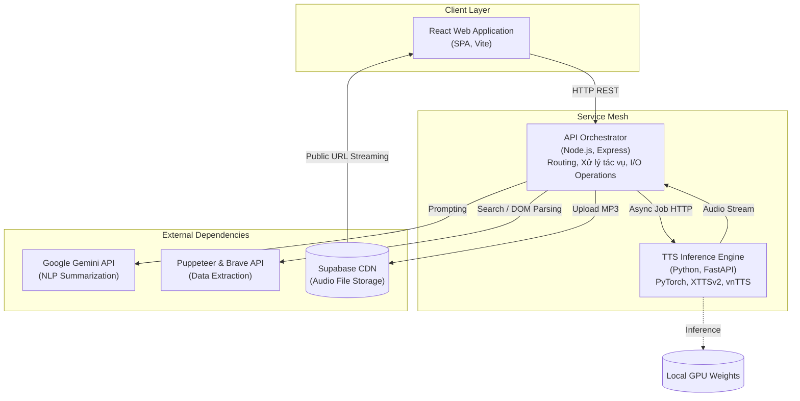
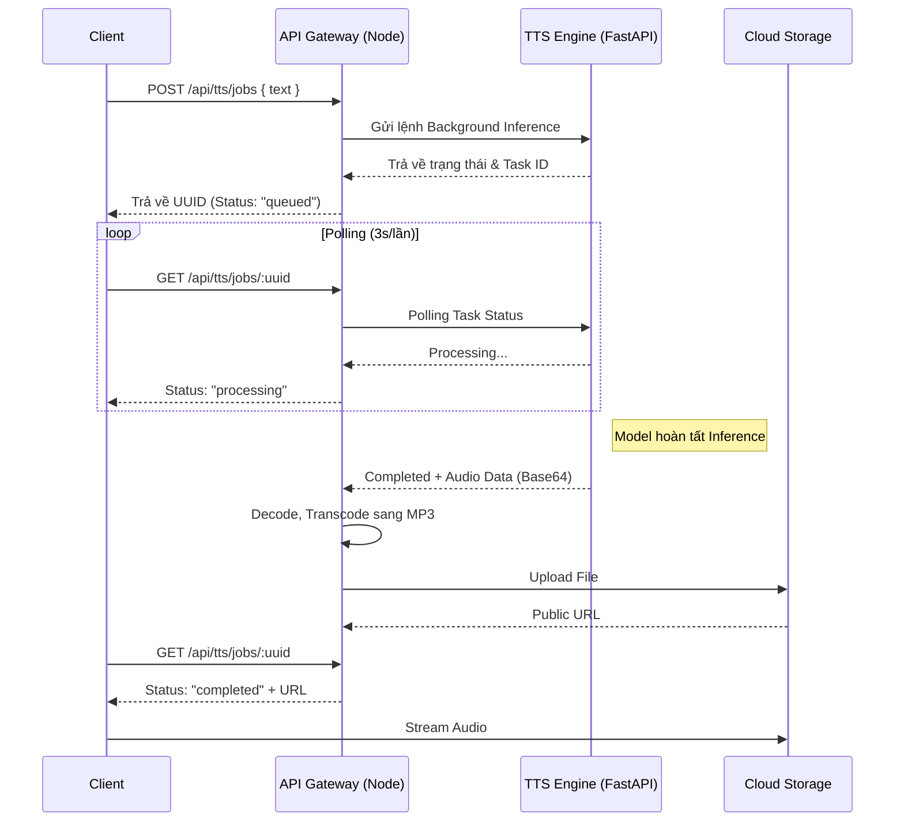

# News Summarizer & Vietnamese TTS System


Một hệ thống phần mềm toàn diện (Full-stack Application) tích hợp AI, được thiết kế để tự động hóa trích xuất thông tin, tóm tắt nội dung bằng mô hình Ngôn ngữ Lớn (LLMs), và tổng hợp giọng nói Tiếng Việt (Text-to-Speech) đa vùng miền dựa trên cấu trúc học sâu (Deep Learning).

Dự án được xây dựng với mục tiêu cung cấp giải pháp tiếp cận thông tin "hands-free", tối ưu thời gian đọc tin tức và hỗ trợ tính năng khả dụng (accessibility) cho người dùng khiếm thị hoặc suy giảm thị lực.

---

## Mục Lục
- [Tổng Quan Kiến Trúc (Architecture Overview)](#tổng-quan-kiến-trúc-architecture-overview)
- [Tính Năng Cốt Lõi (Core Features)](#tính-năng-cốt-lõi-core-features)
- [Thiết Kế Hệ Thống & Quyết Định Kỹ Thuật (Engineering & Architecture Decisions)](#thiết-kế-hệ-thống--quyết-định-kỹ-thuật-engineering--architecture-decisions)
- [Cấu Trúc Thư Mục (Repository Structure)](#cấu-trúc-thư-mục-repository-structure)
- [Hướng Dẫn Triển Khai (Deployment & Setup)](#hướng-dẫn-triển-khai-deployment--setup)
- [Tài Liệu API (API Reference)](#tài-liệu-api-api-reference)

---

## Tổng Quan Kiến Trúc (Architecture Overview)

Hệ thống được thiết kế theo mô hình Microservices, phân tách rõ ràng giữa HTTP API phản hồi nhanh và Dịch vụ Inference tính toán nặng (GPU-bound).



### Luồng Xử Lý Bất Đồng Bộ (Asynchronous Processing Flow)

Để xử lý bài toán **HTTP Timeout** trong quá trình Inference TTS (thường kéo dài đối với các đoạn văn bản lớn), hệ thống triển khai cơ chế **Job Queue & Polling**:

<details>
<summary><b>Chi tiết quy trình sinh Audio (Click to expand)</b></summary>


</details>

---

## Tính Năng Cốt Lõi (Core Features)

1. **Kiết Xuất Dữ Liệu Tự Động (Automated Web Scraping):**
   - Ứng dụng **Brave Search API** để phân tích từ khóa và xếp hạng kết quả tin tức.
   - Triển khai **Puppeteer** ảo hóa trình duyệt (Headless), linh hoạt lọc bỏ quảng cáo, điều hướng và trích xuất cấu trúc DOM trọng tâm của bài báo.

2. **Xử Lý Ngôn Ngữ Tự Nhiên (NLP Summarization):**
   - Tích hợp **Google Gemini AI** xử lý hàng vạn token đầu vào. Trích xuất quan điểm, bảo toàn ngữ cảnh và tóm tắt theo định dạng Markdown trực quan, chia thành các đoạn súc tích định mức 3-5 câu.

3. **Tổng Hợp Giọng Nói Đa Vùng Miền (Vietnamese TTS Synthesis):**
   - Không sử dụng các giọng đọc máy móc (Robotic-voice). Dịch vụ tích hợp mô hình **XTTS v2 Fine-tuned** (Dự án vnTTS).
   - Hỗ trợ Cloning và giả lập ngữ điệu bản địa sâu sắc: **Giọng Bắc chuẩn (Hà Nội)**, **Giọng Trung (Huế)**, và **Giọng Nam (Sài Gòn)**.

4. **Hạ Tầng Lưu Trữ Đám Mây (Cloud Architecture):**
   - Xử lý chuyển mã (Transcoding) tự động từ định dạng thô (`.WAV`) sang định dạng nén (`.MP3`) để tối ưu băng thông mạng.
   - Upload dữ liệu trực tiếp lên kho Object Storage của **Supabase** và cung cấp Content Delivery Network (CDN) tĩnh cho trải nghiệm stream mượt mà phía Client.

---

## Thiết Kế Hệ Thống & Quyết Định Kỹ Thuật (Engineering & Architecture Decisions)

Hệ thống được thiết kế dựa trên các nguyên tắc mở rộng (Scalability) và tối ưu độ trễ (Latency optimization):

- **Tách Biệt Kiến Trúc (Decoupled Microservices):** Tác vụ tính toán I/O mạng (Gọi API, Cào dữ liệu) được giao toàn quyền cho **Node.js (Express)** nhờ ưu điểm vòng lặp sự kiện bất đồng bộ (Non-blocking I/O). Tác vụ sử dụng nhiều tài nguyên tính toán (CPU/GPU-bound) được phân lập thành module **FastAPI** biệt lập. Việc này loại bỏ rủi ro ngắt luồng (thread blocking) ảnh hưởng tới toàn hệ thống.
- **Cơ Chế Hàng Đợi phi trạng thái (Stateless Job Polling):** Quá trình sinh âm thanh ứng dụng kỹ thuật Job Queue. Backend không duy trì kết nối HTTP WebSocket phức tạp mà cấp quyền theo dõi qua ID độc lập. Server hoàn toàn phi trạng thái (Stateless), dễ dàng triển khai theo quy mô ngang (Horizontal Scaling).
- **Phân tán Tài nguyên (Serverless File Hosting):** Lưu trữ tệp tĩnh qua Supabase giúp chuyển tác vụ xử lý băng thông (bandwidth streaming) từ Core Server sang phía nhà cung cấp lưu trữ (Cloud Provider). Giữ hệ thống Backend nhẹ gọn.

---

## Cấu Trúc Thư Mục (Repository Structure)

```text
.
├── backend/                  # API Gateway (Node.js / Express)
│   ├── config/               # Biến môi trường & cấu hình API Key
│   ├── controllers/          # Endpoint Handlers (Search, Scrape, TTS, LLM)
│   ├── routes/               # Quản lý Router
│   ├── services/             # Các lớp nghiệp vụ logic (Transcode, HTTP Clients)
│   └── tts_fastapi/          # Module TTS cơ sở
├── frontend/                 # Client UI (React, Vite)
│   ├── public/
│   └── src/                  # React Components, Context, CSS Modules
├── models/                   # Pre-trained Weights phục vụ Inference
│   ├── vntts-runtime-model/  # Trọng số mô hình (HuggingFace Auto-download)
│   └── XTTSv2-Finetuning.../ # Kiến trúc mã nguồn Model AI
├── src/                      # Jupyter Notebooks phục vụ EDA và Research
├── data/                     # Thư mục lưu trữ siêu dữ liệu (Metadata)
└── README.md                 # Tài liệu hệ thống
```

---

## Hướng Dẫn Triển Khai (Deployment & Setup)

### 1. Yêu Cầu Hệ Thống (System Requirements)
- **Runtime:** Node.js v18+, Python 3.11.
- **Hardware:** Yêu cầu phần cứng NVIDIA GPU có tính năng CUDA 12.1+ để Inference Model Deep Learning tối ưu.
- **Dịch vụ thứ 3 (Third-party Services):** Yêu cầu API Key hợp lệ của [Brave Search](https://brave.com/search/api/), [Google Gemini](https://makersuite.google.com/app/apikey) và [Supabase](https://supabase.com/).

### 2. Thiết Lập API Gateway (Node.js)
```bash
git clone https://github.com/wokovn/Project-LT-ML-23KHDL1-HCMUS.git
cd Project-LT-ML-23KHDL1-HCMUS/backend

# Cài đặt thư viện Node
npm install
cp .env.example .env
```
_Điều chỉnh biến môi trường tại `.env`:_
```env
PORT=5000
BRAVE_API_KEY=your_secured_brave_key
GEMINI_API_KEY=your_secured_gemini_key
TTS_SERVICE_URL=http://127.0.0.1:8001
SUPABASE_URL=https://your-domain.supabase.co
SUPABASE_KEY=your_supabase_service_key
SUPABASE_TTS_BUCKET=tts_audio
```

### 3. Cài Đặt Inference Engine (Python FastAPI)
Tại thư mục Root, tạo môi trường ảo và tải pre-trained weights:
```powershell
# Khởi tạo Sandbox Python 3.11
py -3.11 -m venv .venv311
.\.venv311\Scripts\python.exe -m pip install --upgrade pip

# Cài đặt PyTorch với CUDA 12.1 
.\.venv311\Scripts\python.exe -m pip install torch torchaudio --index-url https://download.pytorch.org/whl/cu121

# Cài đặt Dependency nội bộ của XTTS / FastAPI
.\.venv311\Scripts\python.exe -m pip install -r .\models\XTTSv2-Finetuning-for-New-Languages
equirements.txt
.\.venv311\Scripts\python.exe -m pip install -r .ackend	ts_fastapi
equirements.txt

# Gọi HuggingFace CLI tải Weights Model vnTTS (Thực thi 1 lần duy nhất)
.\.venv311\Scripts\python.exe -c "from huggingface_hub import snapshot_download; snapshot_download(repo_id='anhnh2002/vnTTS', repo_type='model', local_dir='models/vntts-runtime-model')"
```

### 4. Xây Dựng Giao Diện (Frontend)
```bash
cd ../frontend
npm install
cp .env.example .env

# Chỉnh .env nội bộ Frontend
# VITE_API_URL=http://localhost:5000
```

---

## Vận Hành Ứng Dụng (Running the Application)

Hệ thống cung cấp Automation Script hỗ trợ vận hành song song toàn bộ cấu trúc:

```powershell
# Đối với môi trường Local Development (Hot-reloading Enable)
.\quickstart.ps1 -Mode dev

# Đối với môi trường Production (Frontend static build)
.\quickstart.ps1 -Mode start
```

*(Trong trường hợp khởi chạy thủ công, cần khởi phát `uvicorn` trên port 8001 trước, sau đó chạy `npm start` tại backend và `npm run dev` tại frontend).*

---

## Tài Liệu API (API Reference)

Tóm tắt các Endpoints cốt lõi tại `localhost:5000`:

| Endpoint | Method | Payload | Mô tả xử lý (Description) |
| :--- | :---: | :--- | :--- |
| `/api/search` | `POST` | `{ "query": "..." }` | Kích hoạt Brave API tìm kiếm thông tin mới nhất. |
| `/api/scrape` | `POST` | `{ "url": "..." }` | Gửi trình duyệt ảo quét HTML, trích xuất cấu trúc văn bản. |
| `/api/gemini` | `POST` | `{ "prompt": "..." }` | Invoke quy trình tóm tắt thông tin trên nền tảng AI. |
| `/api/tts/jobs` | `POST` | `{ "text": "..." }` | Queue 1 tệp văn bản để tiến hành đúc âm thanh. |
| `/api/tts/jobs/:id` | `GET` | N/A | Fetch kiểm tra trạng thái Task, trả về Link Supabase. |

---