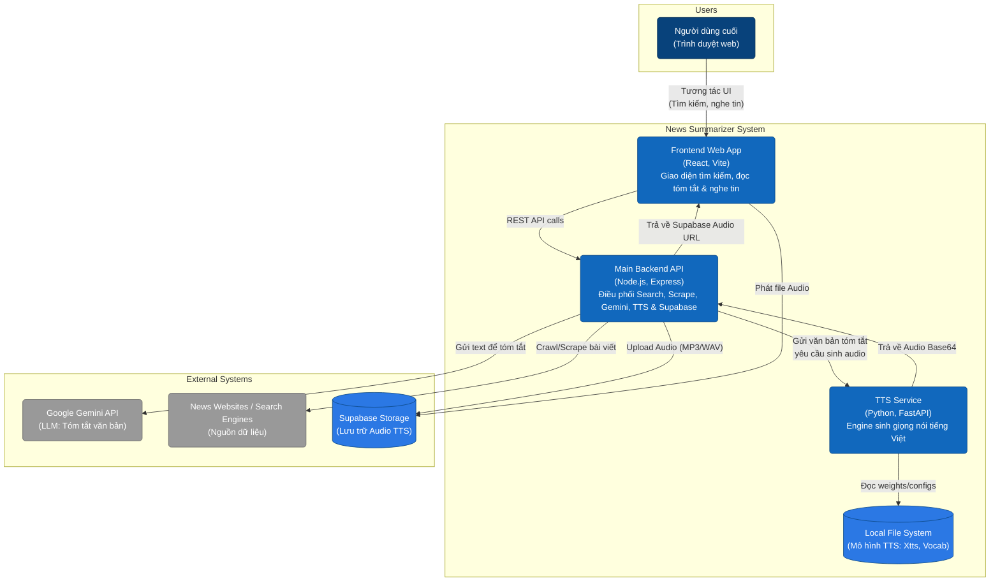

```mermaid
flowchart TB
    %% C4 Container Diagram cho Toàn bộ Hệ thống
    
    subgraph Users
        U["Người dùng cuối<br/>(Trình duyệt web)"]
    end

    subgraph "News Summarizer System"
        UI["Frontend Web App<br/>(React, Vite)<br/>Giao diện tìm kiếm, đọc tóm tắt & nghe tin"]
        
        NodeAPI["Main Backend API<br/>(Node.js, Express)<br/>Điều phối Search, Scrape, Gemini, TTS & Supabase"]
        
        TTS_API["TTS Service<br/>(Python, FastAPI)<br/>Engine sinh giọng nói tiếng Việt"]
        
        STORAGE[("Local File System<br/>(Mô hình TTS: Xtts, Vocab)")]
    end

    subgraph "External Systems"
        Gemini["Google Gemini API<br/>(LLM: Tóm tắt văn bản)"]
        Websites["News Websites / Search Engines<br/>(Nguồn dữ liệu)"]
        Supabase[("Supabase Storage<br/>(Lưu trữ Audio TTS)")]
    end

    U -->|"Tương tác UI<br/>(Tìm kiếm, nghe tin)"| UI
    UI -->|"REST API calls"| NodeAPI
    NodeAPI -->|"Crawl/Scrape bài viết"| Websites
    NodeAPI -->|"Gửi text để tóm tắt"| Gemini
    NodeAPI -->|"Gửi văn bản tóm tắt<br/>yêu cầu sinh audio"| TTS_API
    TTS_API -->|"Đọc weights/configs"| STORAGE
    TTS_API -->|"Trả về Audio Base64"| NodeAPI
    NodeAPI -->|"Upload Audio (MP3/WAV)"| Supabase
    NodeAPI -->|"Trả về Supabase Audio URL"| UI
    UI -->|"Phát file Audio"| Supabase

    classDef container fill:#1168bd,stroke:#0b4884,color:#ffffff,rx:5px,ry:5px
    classDef database fill:#2b78e4,stroke:#0b4884,color:#ffffff,rx:5px,ry:5px
    classDef person fill:#08427b,stroke:#052e56,color:#ffffff,rx:5px,ry:5px
    classDef external fill:#999999,stroke:#666666,color:#ffffff,rx:5px,ry:5px
    
    class U person
    class UI,NodeAPI,TTS_API container
    class STORAGE,Supabase database
    class Gemini,Websites external
```
