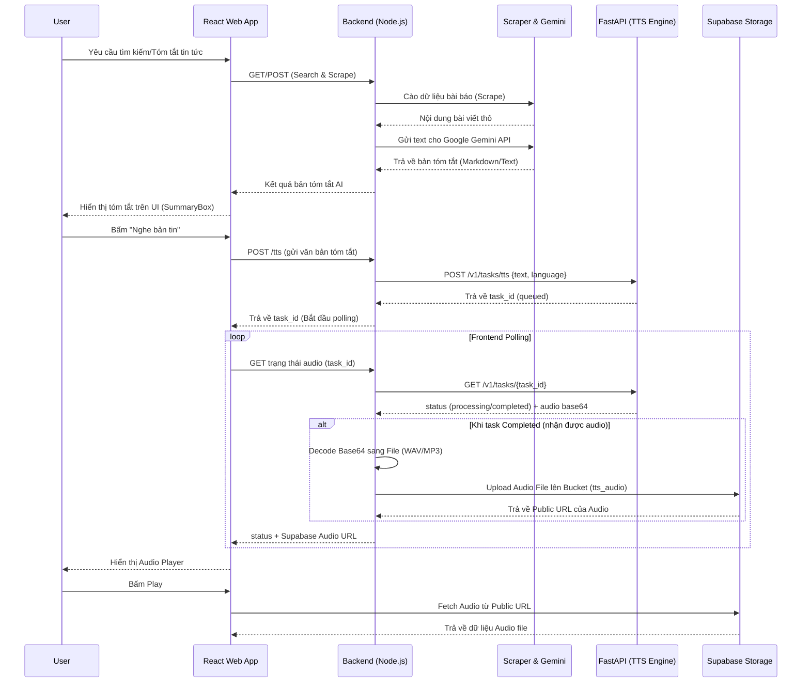

```mermaid
sequenceDiagram
    %% End-to-End User Flow (Summarize & TTS)
    
    participant User
    participant Frontend as React Web App
    participant NodeAPI as Backend (Node.js)
    participant External as Scraper & Gemini
    participant TTS as FastAPI (TTS Engine)
    participant Supabase as Supabase Storage
    
    %% Phase 1: Summarization
    User->>Frontend: Yêu cầu tìm kiếm/Tóm tắt tin tức
    Frontend->>NodeAPI: GET/POST (Search & Scrape)
    NodeAPI->>External: Cào dữ liệu bài báo (Scrape)
    External-->>NodeAPI: Nội dung bài viết thô
    NodeAPI->>External: Gửi text cho Google Gemini API
    External-->>NodeAPI: Trả về bản tóm tắt (Markdown/Text)
    NodeAPI-->>Frontend: Kết quả bản tóm tắt AI
    Frontend-->>User: Hiển thị tóm tắt trên UI (SummaryBox)
    
    %% Phase 2: TTS Audio Generation & Cloud Storage
    User->>Frontend: Bấm "Nghe bản tin"
    Frontend->>NodeAPI: POST /tts (gửi văn bản tóm tắt)
    NodeAPI->>TTS: POST /v1/tasks/tts {text, language}
    TTS-->>NodeAPI: Trả về task_id (queued)
    NodeAPI-->>Frontend: Trả về task_id (Bắt đầu polling)
    
    loop Frontend Polling
        Frontend->>NodeAPI: GET trạng thái audio (task_id)
        NodeAPI->>TTS: GET /v1/tasks/{task_id}
        TTS-->>NodeAPI: status (processing/completed) + audio base64
        
        alt Khi task Completed (nhận được audio)
            NodeAPI->>NodeAPI: Decode Base64 sang File (WAV/MP3)
            NodeAPI->>Supabase: Upload Audio File lên Bucket (tts_audio)
            Supabase-->>NodeAPI: Trả về Public URL của Audio
        end
        
        NodeAPI-->>Frontend: status + Supabase Audio URL
    end
    
    Frontend-->>User: Hiển thị Audio Player
    User->>Frontend: Bấm Play
    Frontend->>Supabase: Fetch Audio từ Public URL
    Supabase-->>Frontend: Trả về dữ liệu Audio file
```
