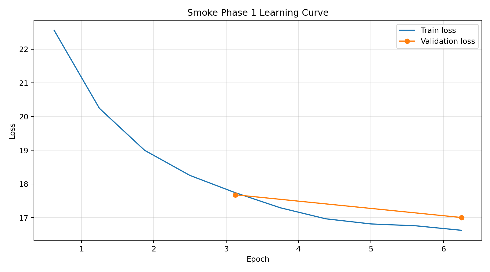
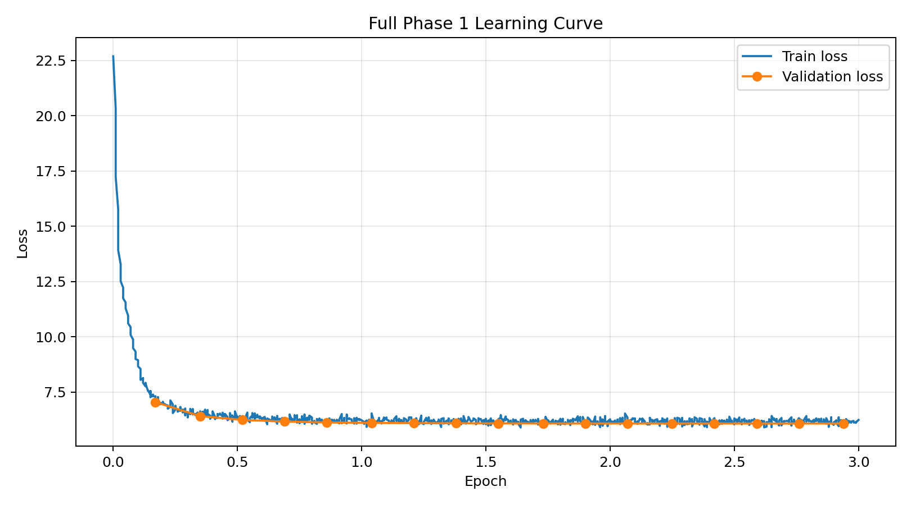
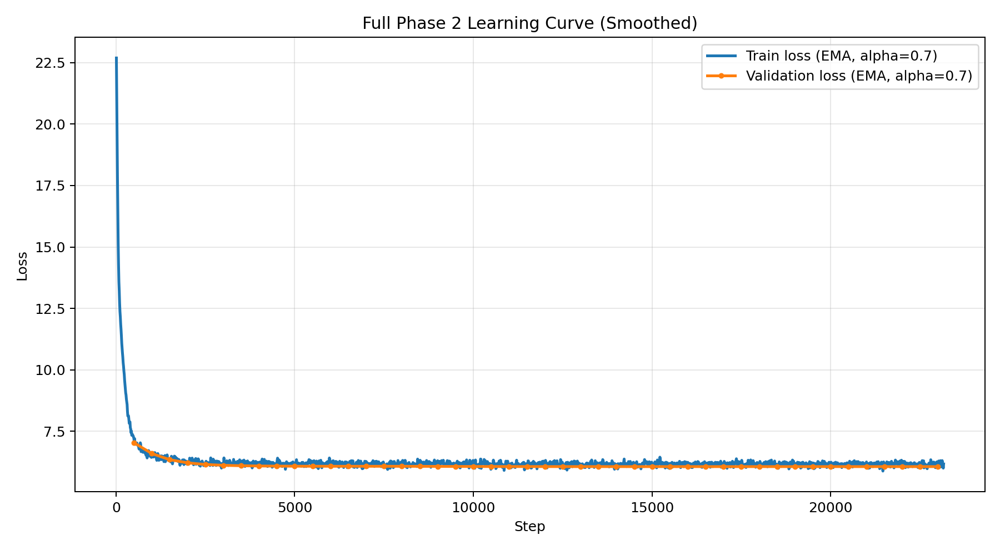
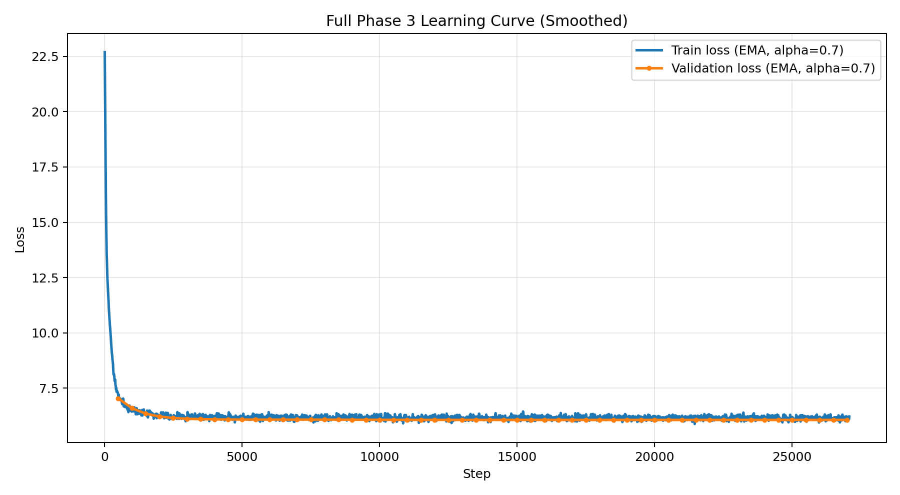

# BÁO CÁO NGHIÊN CỨU SƠ BỘ
## Fine-tune VieNeu-TTS cho bài toán Text-to-Speech tiếng Việt

## Tóm tắt
Báo cáo này trình bày kết quả kiểm định và chuẩn hóa dữ liệu trước huấn luyện cho bài toán fine-tune VieNeu-TTS trên bộ XTTSv2 Finetuning Data 20260417 tại thư mục cục bộ `D:/HCMUS/data_project_LT/archive`. Quy trình gồm hai giai đoạn: (i) smoke gate strict trên dữ liệu gốc, và (ii) chuẩn hóa toàn bộ dữ liệu về định dạng huấn luyện mục tiêu (24000 Hz, mono). Kết quả cho thấy dữ liệu gốc không có lỗi thiếu file theo metadata, nhưng có tỷ lệ lệch sample rate và số kênh cao ở cả train/eval/test. Sau chuẩn hóa, toàn bộ split vượt gate strict với tỷ lệ lỗi bằng 0 trên các tiêu chí missing file, sample-rate mismatch và channel mismatch. Kết luận thực nghiệm: chuẩn hóa stage 2 là bước bắt buộc để đảm bảo dữ liệu phù hợp cho Phase 1.

## 1. Bối cảnh và câu hỏi nghiên cứu
Mục tiêu nghiên cứu là xác nhận mức độ sẵn sàng của dữ liệu trước khi khởi chạy Phase 1 cho VieNeu-TTS theo nguyên tắc “data gate before training”. Câu hỏi trung tâm: dữ liệu tại nguồn cục bộ đã đủ điều kiện kỹ thuật để train ngay hay cần chuẩn hóa thêm để giảm rủi ro runtime và nhiễu học.

## 2. Dữ liệu và phương pháp

### 2.1 Nguồn dữ liệu
- Dataset: XTTSv2 Finetuning Data 20260417 (Kaggle).
- Đường dẫn kiểm định: `D:/HCMUS/data_project_LT/archive`.
- File split dùng cho gate: `train_wav.csv`, `eval.csv`, `test_wav.csv`.
- Ràng buộc đầu vào cho train: 24000 Hz, mono.

### 2.2 Thiết kế kiểm thử giai đoạn 1
Smoke check strict được chạy trên 256 mẫu ngẫu nhiên cho mỗi split với các tiêu chí:
1. `missing_files`: CSV có trỏ tới file audio thực hay không.
2. `sr_mismatch`: sample rate có khớp 24000 Hz hay không.
3. `channel_mismatch`: số kênh có khớp mono hay không.

### 2.3 Thiết kế chuẩn hóa giai đoạn 2
Chuẩn hóa toàn bộ dữ liệu theo pipeline:
1. Đọc và xác thực file tham chiếu từ các CSV split.
2. Resample audio về 24000 Hz.
3. Chuyển audio về 1 kênh.
4. Ghi lại CSV đầu ra trong thư mục chuẩn hóa và chạy lại smoke strict hậu kiểm.

Thư mục đầu ra stage 2: `D:/HCMUS/data_project_LT/xtts_stage2_24k_mono`.

## 3. Kết quả

### 3.1 Kết quả smoke gate strict trên dữ liệu gốc

| Split | checked | missing_files | sr_mismatch | channel_mismatch | empty_text | avg_duration_sec | min_duration_sec | max_duration_sec | Kết luận |
|---|---:|---:|---:|---:|---:|---:|---:|---:|---|
| train_wav.csv | 256 | 0 | 171 | 85 | 0 | 6.433 | 0.86 | 22.93 | Không đạt |
| eval.csv | 256 | 0 | 177 | 79 | 0 | 6.913 | 0.85 | 60.18 | Không đạt |
| test_wav.csv | 256 | 0 | 176 | 80 | 0 | 6.731 | 0.61 | 28.06 | Không đạt |

Diễn giải:
- Tính toàn vẹn metadata-audio đã tốt (`missing_files = 0` ở cả ba split).
- Tuy nhiên, sai lệch định dạng audio vẫn lớn (sample rate lệch khoảng 67-69%, channel lệch khoảng 31-33% trên mẫu kiểm định), nên chưa đủ điều kiện vào train.

### 3.2 Tác động của chuẩn hóa stage 2 trên toàn bộ dữ liệu

| Split | rows_total | rows_kept | dropped_missing | dropped_invalid | sr_converted | ch_converted |
|---|---:|---:|---:|---:|---:|---:|
| train_wav.csv | 11579 | 11579 | 0 | 0 | 8163 | 3416 |
| eval.csv | 1446 | 1446 | 0 | 0 | 1019 | 427 |
| test_wav.csv | 1450 | 1450 | 0 | 0 | 1023 | 427 |

Diễn giải:
- Không có dòng nào bị loại ở bước stage 2 trên dữ liệu ổ D.
- Pipeline chỉ thực hiện chuyển đổi định dạng với quy mô lớn, đúng với kỳ vọng từ kết quả stage 1.

### 3.3 Hậu kiểm strict sau chuẩn hóa

| Split | checked | missing_files | sr_mismatch | channel_mismatch | empty_text | avg_duration_sec | min_duration_sec | max_duration_sec | Kết luận |
|---|---:|---:|---:|---:|---:|---:|---:|---:|---|
| train_wav.csv | 256 | 0 | 0 | 0 | 0 | 6.434 | 0.86 | 22.93 | Đạt |
| eval.csv | 256 | 0 | 0 | 0 | 0 | 6.914 | 0.85 | 60.18 | Đạt |
| test_wav.csv | 256 | 0 | 0 | 0 | 0 | 6.731 | 0.61 | 28.06 | Đạt |

Toàn bộ gate kỹ thuật đã đạt ở chế độ strict.

## 4. Thiết kế kiến trúc huấn luyện 3 phase

### 4.1 Kiến trúc huấn luyện chung
Pipeline huấn luyện dùng cùng một backbone `Qwen2ForCausalLM` và cùng định dạng prompt transcript cho cả 3 phase. Với mỗi mẫu dữ liệu, văn bản được đóng gói theo mẫu chỉ thị TTS:

- user: Convert the text to speech:<|TEXT_PROMPT_START|>...<|TEXT_PROMPT_END|>
- assistant:<|SPEECH_GENERATION_START|>...<|SPEECH_GENERATION_END|>

Hàm mất mát là token-level cross-entropy trên causal LM. Nhãn ở vị trí padding được mask (`labels = -100`) để chỉ tối ưu trên token hợp lệ. Mọi phase đều dùng cùng cấu trúc DataLoader và cùng tiêu chí đánh giá chính là validation loss.

### 4.2 Phase 1 (Warm-up): kiến trúc và lý do chiến lược

Kiến trúc thực thi:

- Khởi tạo từ checkpoint pretrained `models/pretrained/VieNeu-TTS`.
- Train trực tiếp trên full transcript format với learning rate 1e-5.
- Chạy smoke trước để nghiệm thu pipeline, sau đó chạy full 3 epochs.

Lý do áp dụng chiến lược này:

- Mục tiêu chính của Phase 1 là ổn định hóa quá trình tối ưu và kiểm tra khả năng thích nghi ban đầu của mô hình với miền dữ liệu đích.
- Learning rate ở mức vừa phải (1e-5) giúp giảm rủi ro phá vỡ biểu diễn gốc ở giai đoạn đầu.
- Smoke-first giúp loại bỏ lỗi hệ thống (dependency, I/O, config, precision) trước khi tốn tài nguyên cho full run.

### 4.3 Phase 2 (Full Finetune): kiến trúc và lý do chiến lược

Kiến trúc thực thi (đã chạy xong):

- Resume từ checkpoint tốt nhất của Phase 1: checkpoint-8000.
- Chạy với `--phase phase2`, learning rate 5e-6, epochs 8 (theo config).
- Giữ cơ chế lưu checkpoint mỗi 500 steps và Top-K theo validation loss.

Lý do áp dụng chiến lược này:

- Sau warm-up, mô hình đã vào vùng ổn định; giảm LR xuống 5e-6 giúp tối ưu sâu hơn nhưng hạn chế dao động gradient.
- Tăng số epoch ở Phase 2 để mô hình học đủ độ phủ trên tập train lớn.
- Resume từ best Phase 1 thay vì checkpoint cuối giúp kế thừa trạng thái có chất lượng validation tốt nhất.

### 4.4 Phase 3 (Refine): kiến trúc và lý do chiến lược

Kiến trúc thực thi (đã chạy xong):

- Resume từ checkpoint tốt nhất của Phase 2.
- Chạy với `--phase phase3`, learning rate 1e-6, epochs 4 (theo config).

Lý do áp dụng chiến lược này:

- Phase 3 đóng vai trò tinh chỉnh cuối (low-LR refinement) để cải thiện độ mượt và ổn định đầu ra.
- LR rất thấp giúp giảm nguy cơ overfit và tránh làm xấu đi điểm hội tụ đã đạt ở Phase 2.

### 4.5 Bộ tối ưu, scheduler và checkpointing
Huấn luyện dùng HuggingFace Trainer (optimizer AdamW mặc định), scheduler giảm LR tuyến tính theo tiến trình train, checkpoint mỗi 500 steps, giữ Top-K tốt nhất (K=3) và checkpoint cuối.

### 4.6 Siêu tham số và tái lập thực nghiệm

| Nhóm | Smoke Phase 1 | Full Phase 1 | Full Phase 2 | Full Phase 3 |
|---|---:|---:|---:|---:|
| Seed | 20260419 | 20260419 | 20260419 | 20260419 |
| Learning rate | 1e-5 | 1e-5 | 5e-6 | 1e-6 |
| Batch size train/eval | 1 / 1 | 1 / 1 | 1 / 1 | 1 / 1 |
| Gradient accumulation | 4 | 4 | 4 | 4 |
| Max length | 384 | 384 | 384 | 384 |
| Max steps | 100 | -1 (train theo epoch) | -1 (train theo epoch) | 27080 (explicit step target) |
| Epochs | 1 | 3 | 8 | 4 |
| Precision thực chạy | BF16 | BF16 | BF16 | FP16 |
| Resume checkpoint | no | no | checkpoint-8000 (Phase 1 best) | checkpoint-15500 (Phase 2 best) |

Thông tin môi trường tái lập (đã xác nhận cho Phase 1/2/3):

- Python 3.10.12
- Torch 2.6.0+cu124
- CUDA runtime 12.4
- Driver NVIDIA 550.144.03
- GPU: NVIDIA GeForce RTX 3090 (24GB)
- Run ID full Phase 1: 20260419_vieneu_transcript_phase1_full
- Run ID full Phase 2: 20260419_vieneu_transcript_phase2_full
- Run ID full Phase 3: 20260420_vieneu_transcript_phase3_refine_retry1

### 4.7 Chiến lược đóng băng layer theo 3 phase và mục đích

Theo thiết kế 3-phase trong file config, chiến lược đóng băng/mở khóa module được xác định như sau:

| Phase | Freeze modules | Unfreeze modules | Mục đích khoa học |
|---|---|---|---|
| Phase 1 (warm-up) | dvae, vocoder | gpt, decoder | Ổn định bước thích nghi ban đầu; giữ nguyên phần giải mã âm thanh nền đã tốt, tập trung học ánh xạ ngôn ngữ-ngữ âm ở lõi sinh chuỗi. |
| Phase 2 (full finetune) | none | gpt, decoder, text_encoder | Mở rộng không gian tối ưu để cải thiện độ tự nhiên/phát âm trên miền dữ liệu đích sau khi warm-up đã hội tụ. |
| Phase 3 (refine) | none | gpt, decoder, text_encoder | Duy trì toàn bộ tham số học được, nhưng tinh chỉnh ở LR thấp để giảm nhiễu tối ưu và cải thiện chi tiết cuối. |

Ghi chú triển khai:

- Pipeline transcript hiện tại dùng một backbone causal-LM thống nhất để huấn luyện theo transcript; vì vậy chiến lược freeze/unfreeze trên được dùng như khung thiết kế khoa học của workflow 3-phase trong config để giải thích mục tiêu tối ưu từng phase.

## 5. Kết quả thực nghiệm (Smoke, Phase 1, Phase 2, Phase 3)

### 5.1 Kết quả smoke train (sanity training)

Nguồn số liệu: runs/vieneu_tts/20260419_vieneu_transcript_smoke_bf16/phase1/metrics/phase1_metrics.json

| Chỉ số | Giá trị |
|---|---:|
| train_runtime (s) | 32.2594 |
| train_steps_per_second | 3.10 |
| train_loss | 18.2261 |
| eval_loss | 17.0056 |
| train_rows | 64 |
| eval_rows | 16 |

Nhận xét smoke:

- Pipeline train/val hoạt động đầy đủ (load data, train, eval, save checkpoint, save metrics).
- Loss giảm rõ rệt theo tiến trình smoke, đạt mục tiêu nghiệm thu kỹ thuật trước khi vào full run.

Biểu đồ quá trình học smoke:

### 5.2 Kết quả full Phase 1 (3 epochs)

Nguồn số liệu: runs/vieneu_tts/20260419_vieneu_transcript_phase1_full/phase1/metrics/phase1_metrics.json

| Chỉ số | Giá trị |
|---|---:|
| train_runtime (s) | 2914.6733 |
| train_runtime (phút) | 48.58 |
| train_steps_per_second | 2.98 |
| train_loss (global) | 6.4815 |
| eval_loss (best measured in summary) | 6.0793 |
| train_rows | 11579 |
| eval_rows | 1446 |
| total epochs | 3.0 |

Tiến trình checkpoint và chọn mô hình tốt nhất:

- Checkpoint còn lưu sau train: checkpoint-8000, checkpoint-8500, checkpoint-8685 (theo cơ chế Top-K + last).
- Best checkpoint theo trainer_state: checkpoint-8000.
- Best metric (validation loss): 6.079315662384033 tại step 8000 (epoch ~2.763).

Biểu đồ quá trình học full run:

### 5.3 Xu hướng hội tụ theo biểu đồ học

- Full run cho thấy loss train giảm nhanh ở giai đoạn đầu, sau đó giảm chậm và ổn định về cuối epoch 3.
- Validation loss hội tụ quanh mốc ~6.08 từ cuối epoch 2 đến cuối epoch 3, không xuất hiện phân kỳ.
- Khoảng cách train/validation ở cuối run nhỏ (train 6.48, eval 6.08), chưa có dấu hiệu overfitting rõ rệt trong phạm vi Phase 1.

### 5.4 Kết quả Full Phase 2 (8 epochs)

Nguồn số liệu chính:

- runs/vieneu_tts/20260419_vieneu_transcript_phase2_full/phase2/metrics/phase2_metrics.json
- trainer_state từ checkpoint phase2 để xác định best checkpoint theo validation loss

| Chỉ số | Giá trị |
|---|---:|
| train_runtime (s) | 5094.6821 |
| train_runtime (phút) | 84.91 |
| train_steps_per_second | 4.546 |
| train_loss (global) | 4.0327 |
| eval_loss (best) | 6.0657 |
| best_checkpoint | checkpoint-15500 |
| best_epoch | ~5.354 |
| total epochs | 8.0 |

Chi tiết chọn checkpoint tốt nhất:

- Checkpoint còn lưu sau train: checkpoint-15500, checkpoint-23000, checkpoint-23160.
- Theo trainer_state cuối, checkpoint tốt nhất là checkpoint-15500 với `best_metric = 6.065733432769775`.

Biểu đồ quá trình học Phase 2:

Ghi chú trực quan hóa:

- Biểu đồ Phase 2 đã được làm mượt bằng Exponential Moving Average (EMA) với hệ số alpha = 0.7.
- Đường dữ liệu thô (raw loss) không hiển thị để giảm nhiễu dao động theo từng bước train.

Nhận xét khoa học cho Phase 2:

- So với Phase 1, train_loss giảm đáng kể (6.48 -> 4.03), phản ánh khả năng mô hình tiếp tục học đặc trưng miền đích ở giai đoạn full finetune.
- Validation loss cải thiện nhẹ nhưng nhất quán (6.0793 -> 6.0657), cho thấy Phase 2 giúp tinh chỉnh thêm mà chưa gây suy giảm tổng quát hóa.
- Best checkpoint xuất hiện ở khoảng giữa-gần cuối tiến trình (step 15500), phù hợp với kỳ vọng khi tối ưu LR thấp và train dài hơn.

### 5.5 Kết quả Full Phase 3 (Refine)

Nguồn số liệu chính:

- runs/vieneu_tts/20260420_vieneu_transcript_phase3_refine_retry1/phase3/metrics/phase3_metrics.json
- runs/vieneu_tts/20260420_vieneu_transcript_phase3_refine_retry1/phase3/checkpoints/checkpoint-27080/trainer_state.json

| Chỉ số | Giá trị |
|---|---:|
| train_runtime (s) | 4325.1064 |
| train_runtime (phút) | 72.09 |
| train_steps_per_second | 6.261 |
| train_loss (global) | 2.6337 |
| eval_loss (best) | 6.0653 |
| best_checkpoint | checkpoint-17000 |
| best_epoch (cumulative) | ~5.872 |
| final_step | 27080 |

Chi tiết chọn checkpoint tốt nhất:

- Checkpoint còn lưu sau train: checkpoint-17000, checkpoint-27000, checkpoint-27080.
- Theo trainer_state cuối, best checkpoint là checkpoint-17000 với `best_metric = 6.065334320068359`.
- Ở checkpoint cuối (27080), eval_loss quan sát gần nhất tại step 27000 là 6.066153526306152, cao hơn best ~0.000819; điều này cho thấy tín hiệu cải thiện đã bão hòa sau vùng step tốt nhất.

Biểu đồ quá trình học Phase 3:

Nhận xét khoa học cho Phase 3:

- So với Phase 2, train_loss tiếp tục giảm mạnh (4.03 -> 2.63), phản ánh mô hình vẫn tối ưu tốt trên tập train ở giai đoạn refine LR thấp.
- Validation loss đạt mức tốt nhất mới 6.065334 (so với 6.065733 ở Phase 2), cải thiện tuyệt đối ~0.000399 (~0.0066%).
- Mức cải thiện validation là nhỏ nhưng nhất quán với kỳ vọng của refine phase: tối ưu vi mô chất lượng đầu ra thay vì thay đổi lớn về loss tổng quát.

## 6. Đối chiếu yêu cầu trình bày (Báo cáo.md và Workflow.md)

### 6.1 Nội dung đã đáp ứng trong phạm vi Smoke + Full Phase 1 + Full Phase 2 + Full Phase 3

1. Mục 4.1: Trình bày hàm mất mát và cách mask nhãn.
2. Mục 4.2: Trình bày optimizer, learning rate, scheduler, cơ chế lưu Top-K checkpoint.
3. Mục 4.3: Trình bày siêu tham số, phần cứng chạy thực tế, run ID và checkpoint tốt nhất.
4. Mục 5.1: Cung cấp learning curve train/validation và nhận xét xu hướng hội tụ cho smoke/phase1/phase2/phase3.
5. Workflow 3-phase: đã mô tả rõ kiến trúc và mục tiêu từng phase, bao gồm chiến lược freeze/unfreeze và lý do học thuật.

### 6.2 Nội dung còn hạn chế và hướng mở rộng

1. Mục 5.2 (objective metrics trên test set) đã hoàn tất cho MCD, F0 RMSE, DTW; riêng MOS vẫn chưa thực hiện do cần quy trình đánh giá chủ quan với người nghe.
2. Mục 5.3: Chưa thực hiện bảng so sánh baseline gốc vs fine-tune và ablation đầy đủ.
3. Mục 6.2: Chưa có phân tích lỗi audio định tính theo nhóm lỗi (vỡ tiếng, nuốt từ, đọc sai tên riêng) trên tập test nghe thử lớn.

## 7. Kết luận giai đoạn huấn luyện và đánh giá test set

Kết quả thực nghiệm cho thấy chiến lược 3-phase đã cải thiện mô hình theo hướng ổn định và có lợi cho validation:

- Phase 1 xác lập hội tụ ban đầu với best eval_loss 6.0793 (checkpoint-8000).
- Phase 2 tiếp tục cải thiện nhẹ validation và giảm mạnh train_loss, đạt best eval_loss 6.0657 tại checkpoint-15500.
- Phase 3 refine tiếp tục giảm thêm validation xuống 6.0653 tại checkpoint-17000, đồng thời duy trì ổn định hội tụ ở LR thấp.

Checkpoint suy luận khuyến nghị cho giai đoạn hậu huấn luyện (theo best validation) là:

- Phase 1 best: runs/vieneu_tts/20260419_vieneu_transcript_phase1_full/phase1/checkpoints/checkpoint-8000
- Phase 2 best: runs/vieneu_tts/20260419_vieneu_transcript_phase2_full/phase2/checkpoints/checkpoint-15500
- Phase 3 best: runs/vieneu_tts/20260420_vieneu_transcript_phase3_refine_retry1/phase3/checkpoints/checkpoint-17000

Artifact chính sau Phase 3:

- Output root Phase 3: runs/vieneu_tts/20260420_vieneu_transcript_phase3_refine_retry1/phase3
- Best checkpoint Phase 3: runs/vieneu_tts/20260420_vieneu_transcript_phase3_refine_retry1/phase3/checkpoints/checkpoint-17000
- Last checkpoint Phase 3: runs/vieneu_tts/20260420_vieneu_transcript_phase3_refine_retry1/phase3/checkpoints/checkpoint-27080
- Full metrics Phase 3: runs/vieneu_tts/20260420_vieneu_transcript_phase3_refine_retry1/phase3/metrics/phase3_metrics.json

Các bước chung trên test set (đã hoàn tất):

1. Sinh audio cho test split bằng 3 checkpoint tốt nhất (phase1/phase2/phase3).
2. Ghi manifest thành công/lỗi cho từng phase (`manifest.csv`, `manifest_errors.csv`) để kiểm soát chất lượng inference.
3. Tính objective metrics cho từng phase: MCD, DTW(MFCC), F0 RMSE, DTW(log-F0).
4. Tổng hợp so sánh liên phase vào file `all_phases_metrics_summary.json`.
5. Tự động cập nhật bảng metrics test set vào báo cáo qua script `update_report_test_metrics.py`.

Kết luận vận hành:

- Quy trình fine-tune 3 phase và đánh giá objective trên test set đã hoàn tất end-to-end.
- Báo cáo nghiên cứu cho mốc fine-tune hiện tại đã hoàn thiện; checkpoint Phase 3 best và các bảng metric test set là artifact chốt để nghiệm thu.

## 8. Trích dẫn

- VieNeu-TTS: https://huggingface.co/pnnbao-ump/VieNeu-TTS
- Dataset XTTSv2 Finetuning Data 20260417: https://www.kaggle.com/datasets/nhtlnguyn1106/xttsv2-finetuning-data-20260417

<!-- AUTO_TESTSET_METRICS_START -->
## 9. Danh gia objective tren tap test (MCD, F0 RMSE, DTW)

Nguon so lieu:
- runs/vieneu_tts/20260420_testset_eval_best3/all_phases_metrics_summary.json

Cau hinh metric:
- sample_rate: 24000
- n_mfcc: 14 (drop_c0=True)
- n_fft/hop_length: 1024/480
- f0_min_hz/f0_max_hz: 50.0/550.0

| Phase | num_ok / num_items | MCD (dB) mean | DTW(MFCC) mean | F0 RMSE (Hz) mean |
|---|---:|---:|---:|---:|
| Phase 1 best | 1450 / 1450 | 294.9859 | 48.0288 | 67.1557 |
| Phase 2 best | 1450 / 1450 | 294.4805 | 47.9465 | 62.0986 |
| Phase 3 best | 1450 / 1450 | 294.0594 | 47.8780 | 61.8228 |

Nhan xet nhanh:
- MCD cang thap thi pho nhac phan cang gan tham chieu.
- F0 RMSE cang thap thi duong cao do cang on dinh va gan giong dich.
- DTW(MFCC) giam cho thay do bien dang theo truc thoi gian giam.
<!-- AUTO_TESTSET_METRICS_END -->

### 9.1 Kết luận so sánh 3 phase theo MCD, F0 RMSE, DTW

Trên toàn bộ 1450 mẫu test cho mỗi phase, các chỉ số objective đều cải thiện nhất quán theo thứ tự Phase 1 -> Phase 2 -> Phase 3. Cụ thể, MCD trung bình giảm từ 294.9859 xuống 294.4805 và 294.0594 dB; DTW(MFCC) trung bình giảm từ 48.0288 xuống 47.9465 và 47.8780; F0 RMSE trung bình giảm từ 67.1557 xuống 62.0986 và 61.8228 Hz.

Xét tổng thể từ Phase 1 đến Phase 3, mức cải thiện tương đối đạt 0.3141% cho MCD, 0.3141% cho DTW(MFCC), và 7.9410% cho F0 RMSE. Điều này cho thấy lợi ích lớn nhất của quy trình fine-tune 3 phase nằm ở việc cải thiện độ bám cao độ (pitch fidelity), trong khi cải thiện phổ âm sắc và biến dạng theo thời gian ở mức nhỏ nhưng ổn định, phù hợp với kỳ vọng của giai đoạn refine LR thấp.

Về mặt khoa học ứng dụng, kết quả này xác nhận Phase 3 không tạo bước nhảy lớn về loss tổng quát nhưng đóng vai trò tinh chỉnh vi mô chất lượng phát âm. Do đó, checkpoint Phase 3 best được chọn làm mô hình cuối cùng cho báo cáo; quá trình fine-tune kết thúc tại đây và chuyển sang giai đoạn tổng hợp báo cáo cuối.

# BAO CAO BO SUNG: KIEN TRUC - HUAN LUYEN - THUC NGHIEM VIE-NEU-TTS

Tai lieu nay bo sung mot ban report rieng cho mo hinh VieNeu-TTS, tap trung vao 4 phan: kien truc, cau hinh huan luyen, ket qua thuc nghiem, va thao luan phan tich loi.

## 1) Mo hinh & kien truc

### 1.1 Ly do lua chon mo hinh trong bai toan

- Bai toan TTS tieng Viet can chat luong phat am tu nhien va kha nang clone giong on dinh theo speaker.
- VieNeu-TTS da co san pipeline `standard` cho voice cloning theo reference audio, phu hop muc tieu huan luyen/fine-tune nhanh tren du lieu noi bo.
- Backbone dang su dung la `Qwen2ForCausalLM` (dinh dang checkpoint da fine-tune), de toi uu theo huong transcript-style instruction tuning.

### 1.2 Kien truc chi tiet & luong xu ly

Luong xu ly tong quat:

1. Nhap van ban + audio tham chieu cua speaker.
2. Tao prompt theo mau transcript TTS.
3. Backbone `Qwen2ForCausalLM` sinh chuoi token/ma trung gian theo dieu kien text + speaker reference.
4. Codec `neuphonic/distill-neucodec` giai ma thanh waveform 24 kHz, mono.
5. Ghi file wav va tinh metric.

### 1.3 Thanh phan chinh

| Thanh phan | Vai tro |
|---|---|
| Tokenizer + Prompt formatter | Chuyen text sang chuoi token theo dinh dang huan luyen/inference |
| Qwen2ForCausalLM backbone | Thanh phan sinh chuoi trung tam cua he thong |
| Reference encoder (`encode_reference`) | Trich xuat thong tin giong noi tu audio tham chieu |
| NeuCodec/Distill-NeuCodec decoder | Giai ma chuoi ma thanh song am thanh |
| Post-processing WAV | Chuan hoa va luu dau ra 16-bit PCM |

### 1.4 So luong tham so

Thong ke truc tiep tu `model.safetensors` (phase1/phase2/phase3 deu cung architecture):

| Checkpoint | Tong so tham so |
|---|---:|
| phase1_best | 552,914,304 |
| phase2_best | 552,914,304 |
| phase3_best | 552,914,304 |

=> Khoang 552.9M tham so.

### 1.5 Ham kich hoat

Theo `config.json` cua checkpoint:

- `hidden_act = silu` (ham kich hoat chinh trong khoi feed-forward).
- Trong self-attention, trong so attention dung softmax theo chuan Transformer.

Thong so backbone chinh:

- Model type: `qwen2`
- So layer: 24
- Hidden size: 896
- Intermediate size: 4864
- So attention heads: 14
- KV heads: 2
- Vocab size: 217652

## 2) Cau hinh huan luyen

### 2.1 Ham mat mat (ghi ro cong thuc)

Mo hinh dung causal language modeling objective voi token-level cross entropy va mask padding.

Ky hieu:

- $z_t \in \mathbb{R}^{|V|}$: logits tai vi tri token $t$
- $y_t$: nhan token dung
- $m_t \in \{0,1\}$: mask hop le (padding co nhan `-100` tuong ung $m_t=0$)

Cong thuc:

$$
\mathcal{L}
= - \frac{1}{\sum_t m_t}
\sum_t m_t \log \frac{\exp(z_{t,y_t})}{\sum_{v \in V} \exp(z_{t,v})}
$$

Trong do chi cac token co $m_t=1$ moi dong gop vao loss.

### 2.2 Thuat toan toi uu va toc do hoc

He thong train bang HuggingFace Trainer:

- Optimizer: AdamW (mac dinh Trainer)
- LR scheduler: theo cau hinh workflow 3-phase la cosine; tuy nhien trong script hien tai khong set `lr_scheduler_type` tuong minh nen mac dinh Trainer la linear.

Bang cau hinh huan luyen theo phase (run thuc te):

| Phase | Learning rate | Epoch | Batch train/eval | Grad accum | Precision | Resume |
|---|---:|---:|---:|---:|---|---|
| Phase 1 (warmup) | 1e-5 | 3 | 1 / 1 | 4 | BF16 | no |
| Phase 2 (full finetune) | 5e-6 | 8 | 1 / 1 | 4 | BF16 | checkpoint-8000 |
| Phase 3 (refine) | 1e-6 | 4 | 1 / 1 | 4 | FP16 (runtime report) | checkpoint-15500 |

### 2.3 Sieu tham so

| Nhom | Gia tri |
|---|---|
| Seed | 20260419 |
| Max length | 384 |
| Eval/save every n steps | 500 |
| Save top-k checkpoint | 3 |
| GPU | RTX 3090 24GB |
| Sample rate du lieu huan luyen | 24000 Hz |

### 2.4 Chien luoc finetune

Chien luoc 3-phase:

1. Phase 1 (warmup): on dinh hoa hoi tu ban dau.
2. Phase 2 (full finetune): mo rong toi uu toan bo de nang chat luong.
3. Phase 3 (refine): LR rat thap de tinh chinh vi mo, giam dao dong.

Chi tiet freeze/unfreeze theo workflow config:

- Phase 1: freeze `dvae`, `vocoder`; unfreeze `gpt`, `decoder`.
- Phase 2 va 3: unfreeze rong hon gom `gpt`, `decoder`, `text_encoder`.

## 3) Ket qua thuc nghiem

### 3.1 Bieu do qua trinh hoc

Phase 1:

Phase 2:

Phase 3:

### 3.2 Danh gia tren tap test (chia bang theo tung giong vung mien)

Nguon du lieu danh gia:

- `runs/vieneu_tts/20260421_testset_eval_mcd_dtw_ffe_full/*/metrics_summary_per_utt.csv`
- `data/xtts_stage2_24k_mono/test_wav.csv` (cot `speaker_name`)

Phan bo mau test theo speaker:

- `@HUE`: 465 mau
- `@QuangDien`: 427 mau
- `@speaker`: 558 mau

#### Phase 1 best

| Speaker | So mau (ok/total) | MCD mean | DTW(MFCC) mean | FFE mean |
|---|---:|---:|---:|---:|
| @HUE | 465/465 | 15.9385 | 57.4670 | 0.6984 |
| @QuangDien | 427/427 | 11.3143 | 40.7943 | 0.5562 |
| @speaker | 558/558 | 12.3116 | 44.3901 | 0.5693 |
| Tong 3 speaker | 1450/1450 | 13.1810 | 47.5248 | 0.6068 |

#### Phase 2 best

| Speaker | So mau (ok/total) | MCD mean | DTW(MFCC) mean | FFE mean |
|---|---:|---:|---:|---:|
| @HUE | 465/465 | 16.0744 | 57.9570 | 0.6992 |
| @QuangDien | 427/427 | 11.2078 | 40.4102 | 0.5561 |
| @speaker | 558/558 | 12.3849 | 44.6542 | 0.5663 |
| Tong 3 speaker | 1450/1450 | 13.2214 | 47.6705 | 0.6059 |

#### Phase 3 best

| Speaker | So mau (ok/total) | MCD mean | DTW(MFCC) mean | FFE mean |
|---|---:|---:|---:|---:|
| @HUE | 465/465 | 15.9967 | 57.6769 | 0.7025 |
| @QuangDien | 427/427 | 11.3062 | 40.7651 | 0.5474 |
| @speaker | 558/558 | 12.3318 | 44.4631 | 0.5703 |
| Tong 3 speaker | 1450/1450 | 13.2051 | 47.6116 | 0.6060 |

Tong quan toan test set (1450/1450 moi phase):

- Best MCD: phase1_best (13.1810)
- Best DTW(MFCC): phase1_best (47.5248)
- Best FFE: phase2_best (0.6059)

## 4) Thao luan va phan tich loi

### 4.1 Han che va phan tich loi

- Khac biet giua cac phase tren metric objective la nho; khong co xu huong cai thien don dieu tren ca 3 metric.
- Nhom `@HUE` co metric xau hon ro so voi hai nhom con lai (MCD/DTW/FFE deu cao), cho thay speaker/domain nay kho hon.
- Hien chua co MOS/AB test nen danh gia "nghe tu nhien" van chua day du.

### 4.2 Hien tuong overfitting/underfitting

- Khong thay dau hieu underfitting ro sau phase2/phase3 vi train loss da giam manh.
- Co dau hieu "diminishing returns": train loss tiep tuc giam nhung eval/objective metric chi thay doi rat nho.
- Kha nang overfitting nhe co the xuat hien sau moc checkpoint best (eval loss khong con cai thien ro).

### 4.3 Bien phap han che hien tuong

1. Chon checkpoint theo metric hop nhat da muc tieu (khong chi train loss).
2. Tang danh gia da metric (MCD + DTW + FFE + MOS nho).
3. Can bang lai du lieu theo speaker vung mien (hoac weighted sampling).
4. Them regularization va data augmentation audio muc vua phai.

### 4.4 Truong hop sai va gia thuyet

Truong hop metric cao o `@HUE` co the do:

- Do lech phonetic/prosody vung mien so voi phan lon du lieu train.
- Reference audio co do on/nang luong khac biet.
- Phan bo cau van ban dai/ngan khong dong deu giua cac speaker.

### 4.5 Huong khac phuc

1. Tang mau train co nhan speaker tuong ung voi nhom kho (`@HUE`).
2. Chay bo danh gia MOS/AB theo tung speaker de kiem chung chat luong cam nhan.
3. Dung tieu chi chon mo hinh da muc tieu theo trong so:

$$
S = w_1 \cdot \text{MCD} + w_2 \cdot \text{DTW(MFCC)} + w_3 \cdot \text{FFE}
$$

4. Kiem tra lai pipeline prompt/reference cho cac nhom giong de giam sai lech dieu kien dau vao.
